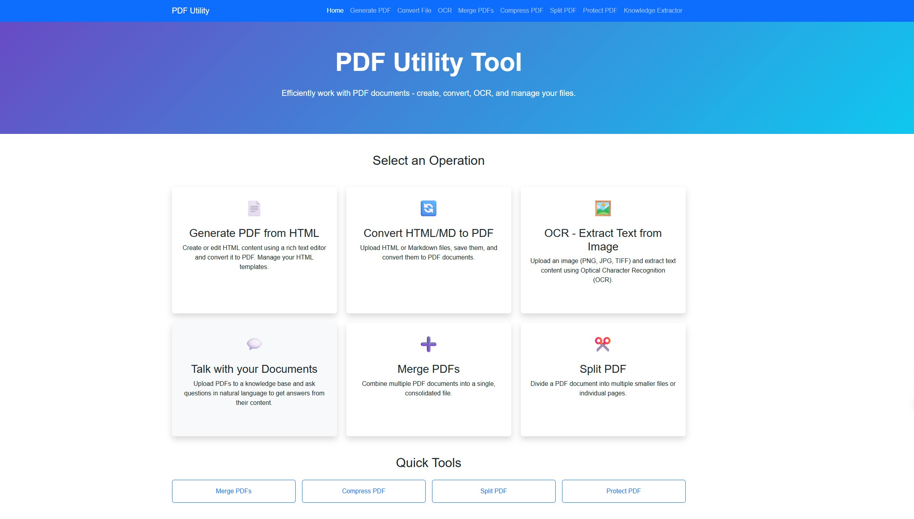
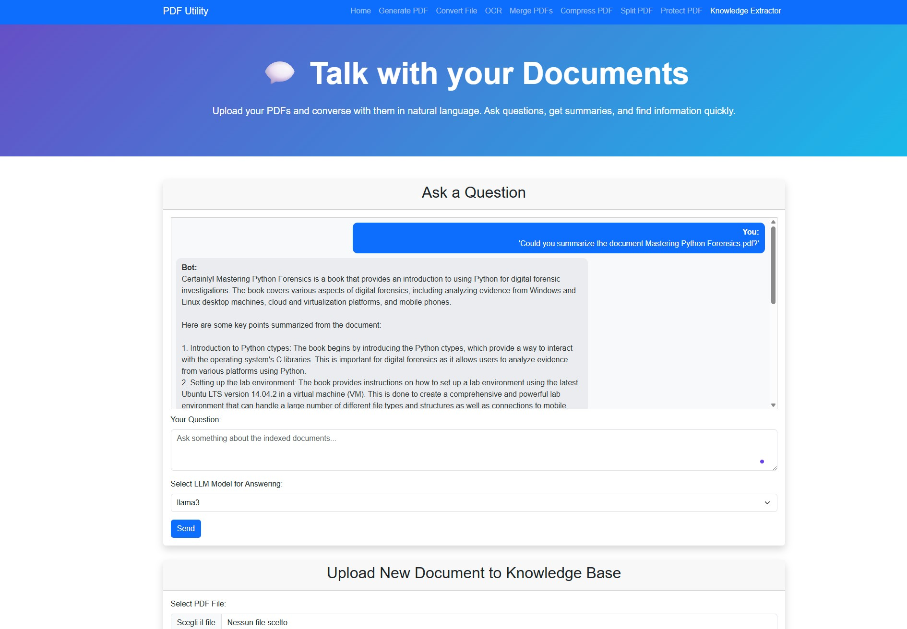

# 📝 PDF PowerTool Suite 🚀

<!-- Badges will be placed here -->

Discover the PDF PowerTool Suite, your all-in-one Spring Boot application for comprehensive PDF manipulation! From dynamic generation and advanced AI-driven OCR to robust document management (merging, optimization, splitting, and protection), we've got you covered. Plus, with seamless local Ollama integration, you can now effortlessly question your documents. Deploy with ease thanks to Docker Compose containerization.

  
  

---

## 📖 Table of Contents

- [✨ Core Capabilities](#-core-capabilities)
- [🚦 Getting Started](#-getting-started)
  - [⚙️ Prerequisites](#️-prerequisites)
  - [🐳 Running with Docker Compose (Recommended)](#-running-with-docker-compose-recommended)
  - [🚀 Installation & Setup (Local Machine - Alternative)](#-installation--setup-local-machine---alternative)
- [🛠️ Key Technologies](#️-key-technologies)
- [🗂️ Roadmap](#️-roadmap)
- [🙌 Credits & License](#-credits--license)

---

## ✨ Core Capabilities

This application empowers you to:
-   **Generate PDFs from HTML**: Create PDFs from HTML, manage templates with a rich text editor.
-   **Convert Files to PDF**: Upload HTML/Markdown, save as templates, convert to PDF.
-   **Generate PDF from Images**: Upload multiple images (PNG, JPG, JPEG, TIFF, BMP, GIF) and combine them into a single PDF document with customizable page settings.
-   **Simple PDF Generation**: Directly convert raw HTML to PDF.
-   **OCR (Optical Character Recognition)**:
    -   Extract text from images (PNG, JPG, TIFF) and PDFs using Tesseract.
    -   Async processing for large PDFs with progress tracking.
    -   **AI-Enhanced OCR Correction**: Improve OCR accuracy using local LLMs (via Ollama) with specialized prompts and text chunking.
    -   Save and manage OCR results.
-   **💬 Talk with your Documents (Q&A with RAG)**:
    -   Utilizes LangChain4j for Retrieval Augmented Generation (RAG).
    -   Ask questions in natural language via a chat interface.
    -   Build a searchable knowledge base from uploaded PDFs (stored in PostgreSQL with vector embeddings).
    -   Manage documents in the knowledge base (view, delete, clear all).
    -   Flexible text extraction options (OCR or direct text).
-   **Merge PDFs**: Combine multiple PDF documents.
-   **Optimize/Compress PDF**: Reduce PDF file size (structural optimization, optional image compression).
-   **Split PDF**: Divide PDFs by page (every page or custom ranges).
-   **Protect PDF**: Add password protection (user and owner passwords).
-   **Watermark PDF**: Add customizable text watermarks with control over opacity, position (center, corners), and text content.

---

## 🚦 Getting Started

### ⚙️ Prerequisites
- Git
- Docker Desktop (or Docker Engine + Docker Compose for Linux)

### 🐳 Running with Docker Compose (Recommended)
This project uses `docker-compose.yml` for the full stack and `docker-compose.dbonly.yml` for database-only mode.

1.  **Clone Repository:** `git clone <repository_url> && cd <repository_directory>/tool/pdfdemo`
2.  **Build JAR:** `./mvnw.cmd clean package` (or `./mvnw clean package`)
3.  **Start Full Stack:** `docker-compose -f docker-compose.yml up --build -d`
    - App: `http://localhost:8080`
    - Ollama (for management): `http://localhost:11434`
4.  **Pull Ollama Models (into Docker):**
    The `entrypoint-ollama.sh` script (used by `docker-compose.yml`) now automatically attempts to pull `llama3` and `phi3` on startup. You can add more or modify the script.
    To manually pull other models: `docker exec -it pdfdemo_ollama ollama pull <model_name>`
5.  **View Logs:** `docker-compose -f docker-compose.yml logs -f pdfdemo-app`
6.  **Stop Services:** `docker-compose -f docker-compose.yml down` (add `-v` to remove volumes).

**Database Only Mode:**
1.  Start DB: `docker-compose -f docker-compose.dbonly.yml up -d`
2.  Configure local `application-postgres.properties` for `localhost:5432`, user `pdfuser`, pass `pdfpassword`, db `pdfdb`.
3.  Run Spring Boot app locally.
4.  Stop DB: `docker-compose -f docker-compose.dbonly.yml down`

---
### 🚀 Installation & Setup (Local Machine - Alternative)
1.  **PostgreSQL**: Install, create `pdfdb` database, user `pdfuser` (password `pdfpassword`) with permissions. Configure `application-postgres.properties`.
2.  **Ollama**: Install from [ollama.ai](https://ollama.ai/), run `ollama pull llama3`. Ensure it's at `http://localhost:11434`.
3.  **Tesseract OCR**: Install and ensure `TESSDATA_PREFIX` is set or Tesseract is in PATH.
4.  **Java 17+ & Maven 3.6+**: Install.
5.  **Build**: `cd tool/pdfdemo && ./mvnw.cmd clean install`
6.  **Run**: `./mvnw.cmd spring-boot:run` or `java -jar target/pdfdemo-0.0.1-SNAPSHOT.jar`. Access at `http://localhost:8080`.

---

## 🛠️ Key Technologies
- Java 17, Spring Boot 3.2.5
- LangChain4j (for RAG, document processing, Ollama embedding)
- Apache PDFBox, OpenHTMLToPDF (PDF manipulation & generation)
- Tesseract OCR (via Tess4J)
- Ollama (local LLMs)
- PostgreSQL (with pgvector for RAG)
- Docker & Docker Compose
- Thymeleaf, Bootstrap 5, CKEditor 5 (Frontend)
- Maven, JUnit 5, Mockito

---

## 🗂️ Roadmap

- 🖋️ **PDF Form Filling**: Programmatic form field filling.
- 📏 **Granular PDF Generation Options**: More control over page size, orientation, margins.
- 🔍 **Dynamic Ollama Model Listing**: Fetch and display available LLMs from Ollama API.
- 🔐 **Enhanced PDF Permissions**: Fine-grained control over document permissions.
- ✨ **Improved Docker Image**: Optimize for size and startup.
- 🚀 **Advanced RAG Features**: Expand LangChain4j with sophisticated document analysis.
- 📊 **Knowledge Analytics**: Insights on knowledge bases and query patterns.

### ✅ **Recently Completed**
- **🧠 LangChain4j Integration & Advanced RAG**: Semantic search, vector embeddings, intelligent document processing.
- **🔧 Custom Similarity Engine**: Database-based cosine similarity.
- 🧩 **Advanced PDF Splitting**: Options for splitting PDFs by custom page ranges. (✅ COMPLETED)
- 💧 **PDF Watermarking**: Customizable text watermarks with position and opacity controls. (✅ COMPLETED)

---

## 🙌 Credits & License

-   **Author**: Maurizio Orani
-   **Core Libraries**: Spring Framework, Apache PDFBox, OpenHTMLToPDF, CommonMark, Tess4J, LangChain4j.
-   **AI Framework**: LangChain4j for document processing, embeddings, RAG.
-   **LLM Integration**: Ollama for local LLM capabilities.
This application features enterprise-grade RAG capabilities for advanced document intelligence.
