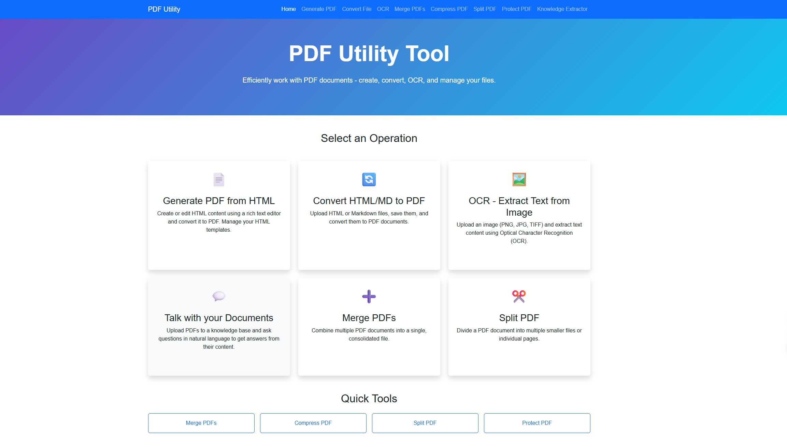
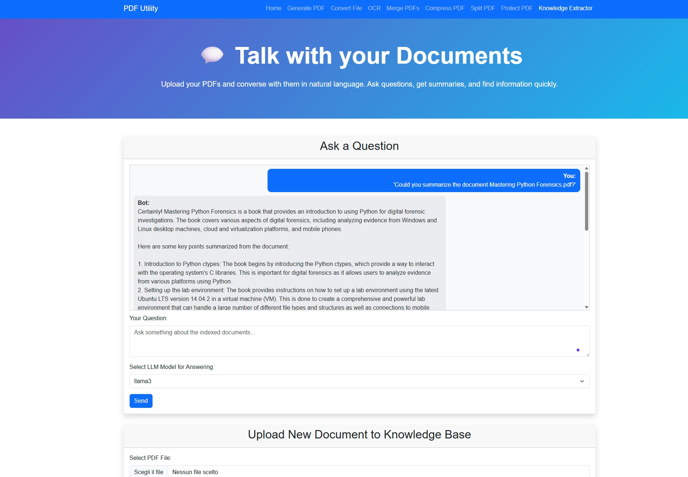

# 📝 PDF PowerTool Suite 🚀

<!-- Badges will be placed here -->
[](https://www.oracle.com/java/technologies/javase-jdk17-downloads.html)
[](https://spring.io/projects/spring-boot)
[](tool/pdfdemo/Readme.md#%EF%B8%8F-running-with-docker-compose-recommended)
[](tool/pdfdemo/Readme.md#%EF%B8%8F-license)

Welcome to the **PDF PowerTool Suite**! This Spring Boot application is your comprehensive solution for a wide array of PDF manipulations, including dynamic generation, advanced OCR with AI-driven enhancement, and robust document management features like merging, optimization, splitting, and protection. Now fully containerized with Docker Compose for easy deployment!

<p align="center">
  
  
</p>

---

## 📖 Table of Contents

- [✨ Core Capabilities](#-core-capabilities)
- [🚦 Getting Started](#-getting-started)
  - [⚙️ Prerequisites](#️-prerequisites)
  - [🐳 Running with Docker Compose (Recommended)](#-running-with-docker-compose-recommended)
    - [Option 1: Full Stack (App + Database + Ollama)](#option-1-full-stack-app--database--ollama)
    - [Option 2: Database Only (for Local App Development)](#option-2-database-only-for-local-app-development)
    - [Managing Ollama Models in Docker (for Full Stack)](#managing-ollama-models-in-docker-for-full-stack)
    - [Important Note on Docker Compose File Names](#important-note-on-docker-compose-file-names)
  - [🚀 Installation & Setup (Local Machine - Alternative)](#-installation--setup-local-machine---alternative)
- [🌟 Features Showcase](#-features-showcase)
- [🌐 Application Endpoints](#-application-endpoints)
  - [🖥️ User Interface Endpoints](#️-user-interface-endpoints)
  - [⚙️ API/Processing Endpoints](#️-apiprocessing-endpoints)
- [🛠️ Technologies Powering the Suite](#️-technologies-powering-the-suite)
- [🗂️ Future Enhancements (Roadmap)](#️-future-enhancements-roadmap)
- [🙌 Credits & License](#-credits--license)

---

## ✨ Core Capabilities

This application empowers you to:
-   **Generate PDFs from HTML**: Create PDFs directly from HTML content, manage HTML templates with a rich text editor, and convert saved templates to PDF.
-   **Convert Files to PDF**: Upload HTML or Markdown files, save them as templates, and convert them to PDF documents.
-   **Simple PDF Generation**: Directly convert raw HTML input into a PDF document.
-   **OCR (Optical Character Recognition)**:
    -   Extract text from various image formats (PNG, JPG, TIFF) and PDF files using Tesseract OCR.
    -   Supports asynchronous processing for large PDF files with progress tracking.
    -   **AI-Enhanced OCR Correction**: Improve the accuracy and readability of extracted OCR text using local Large Language Models (LLMs) via Ollama, with support for specialized prompts based on document type (e.g., generic, business, academic, technical, legal, literary, Italian literary) and text chunking for large inputs.
    -   Save and manage OCR results (original and enhanced text).
-   **💬 Talk with your Documents (Q&A and Knowledge Base Management)**:
    -   **LangChain4j-Powered RAG**: Utilizes Retrieval Augmented Generation (RAG) for answering questions based on the content of your uploaded PDF documents.
    -   **Conversational Interface**: Ask questions in natural language through a chat interface.
    -   **Knowledge Base Creation**: Upload PDF documents to build a searchable knowledge base. Documents are processed, chunked, and their embeddings are stored in a PostgreSQL vector database.
    -   **Document Management**:
        - View a list of all documents currently in the knowledge base.
        - Delete individual documents from the knowledge base.
        - Clear the entire knowledge base by deleting all documents.
    -   **Flexible Text Extraction**: Option to use full OCR (slower, for scanned/image-based PDFs, default is now OFF) or attempt direct text extraction (faster, for text-based PDFs) during document upload.
-   **Merge PDFs**: Combine multiple PDF documents into a single PDF file.
-   **Optimize/Compress PDF**: Reduce PDF file size through structural optimization and optional lossy image compression.
-   **Split PDF**: Divide a PDF document into multiple smaller files (currently supports splitting every page into a separate PDF).
-   **Protect PDF**: Add password protection to PDF files, with options for setting user passwords (to open) and owner passwords (for permissions).

---

## 🚦 Getting Started

The recommended way to run the PDF PowerTool Suite is using Docker Compose. We provide two configurations: one for running the full stack (application, database, and Ollama) and another for running only the PostgreSQL database if you prefer to run the application locally.

### ⚙️ Prerequisites

**For all setups:**
- Ensure Git is installed to clone the repository.
- Basic familiarity with command-line/terminal usage.
- 🐳 Docker Desktop (Windows/Mac) or Docker Engine + Docker Compose (Linux) if using Docker.

**Specific to Local Machine Setup (Alternative to full Docker setup):**
| Requirement         | Description                                                                 | Icon |
|--------------------|-----------------------------------------------------------------------------|------|
| ☕ Java 17+         | Java Development Kit (JDK).                                                 | ☕   |
| 🛠️ Maven 3.6+      | Build automation tool (or use the included `mvnw` wrapper).                 | 🛠️   |
| 🧠 Tesseract OCR   | OCR engine. Ensure it's installed and the `TESSDATA_PREFIX` environment variable is correctly set. The `tessdata` directory is included in the project. | 🧠   |
| 🤖 Ollama          | Local LLM server for AI-powered OCR text enhancement (e.g., `ollama pull llama3`). | 🤖   |

---

### 🐳 Running with Docker Compose (Recommended)

#### Important Note on Docker Compose File Names
This project uses specific filenames for Docker Compose configurations:
-   `docker-compose.yml` (with a hyphen): For the full application stack.
-   `docker-compose.dbonly.yml`: For running only the PostgreSQL database.

If you encounter validation errors like "Additional property POSTGRES_DB is not allowed", ensure you are using the correct file with the `docker-compose -f <filename> ...` command and that there isn't an older, incorrectly named file (e.g., `docker_compose.yml` with an underscore) causing conflicts with your Docker tools or linters.

#### Option 1: Full Stack (App + Database + Ollama)
This method provides a fully containerized environment for the application, PostgreSQL database, and Ollama LLM server.
**File used:** `docker-compose.yml`

1.  **Clone the Repository (if not already done):**
    ```bash
    git clone <repository_url>
    cd <repository_directory>/tool/pdfdemo
    ```

2.  **Build the Application JAR:**
    The Docker build process requires the application JAR.
    ```bash
    # In tool/pdfdemo directory
    ./mvnw.cmd clean package 
    # or ./mvnw clean package for Linux/Mac
    ```

3.  **Start Services:**
    From the `tool/pdfdemo` directory:
    ```bash
    docker-compose -f docker-compose.yml up --build -d
    ```
    - `--build`: Ensures the `pdfdemo-app` image is built (or rebuilt if changed).
    - `-d`: Runs containers in detached mode.
    - Application: `http://localhost:8080`
    - Ollama: `http://localhost:11434` (on host, for management)

4.  **Managing Ollama Models in Docker (for Full Stack):**
    After the `ollama` service is up, pull models into its container:
    - Find container name: `docker ps` (look for `pdfdemo_ollama`).
    - Pull model:
      ```bash
      docker exec -it pdfdemo_ollama ollama pull llama3
      # docker exec -it pdfdemo_ollama ollama pull mistral
      ```
    Models are persisted in the `ollama_data` Docker volume.

5.  **Viewing Logs:**
    ```bash
    docker-compose -f docker-compose.yml logs -f pdfdemo-app
    # or ollama, postgres
    ```

6.  **Stopping Services:**
    ```bash
    docker-compose -f docker-compose.yml down
    ```
    To remove volumes (database, Ollama models): `docker-compose -f docker-compose.yml down -v`

#### Option 2: Database Only (for Local App Development)
Use this if you want to run the Spring Boot application locally (e.g., from your IDE) but use a Dockerized PostgreSQL database.
**File used:** `docker-compose.dbonly.yml`

1.  **Start PostgreSQL Service:**
    From the `tool/pdfdemo` directory:
    ```bash
    docker-compose -f docker-compose.dbonly.yml up -d
    ```
    - This starts only the PostgreSQL service, named `pdfdemo_postgres_dbonly`.
    - It uses a separate data volume `postgres_data_dbonly`.
    - PostgreSQL will be accessible on `localhost:5432`.

2.  **Configure Local Application:**
    Ensure your `src/main/resources/application-postgres.properties` (if using `postgres` profile locally) is configured to connect to `localhost:5432` with user `pdfuser` and password `pdfpassword`, and database `pdfdb`.
    ```properties
    spring.datasource.url=jdbc:postgresql://localhost:5432/pdfdb
    spring.datasource.username=pdfuser
    spring.datasource.password=pdfpassword
    ```

3.  **Run your Spring Boot application locally** (e.g., `./mvnw.cmd spring-boot:run` or from your IDE). It will connect to the Dockerized PostgreSQL.

4.  **Stopping DB Only Service:**
    ```bash
    docker-compose -f docker-compose.dbonly.yml down
    ```
    To remove its volume: `docker-compose -f docker-compose.dbonly.yml down -v`

---
### 🚀 Installation & Setup (Local Machine - Alternative)

This setup is for running the application directly on your host machine.

#### 🐘 1. Database Setup (Local)
**PostgreSQL is mandatory for RAG functionality.**
1.  Install and run PostgreSQL.
2.  Create a database named `pdfdb`.
3.  Create a user `pdfuser` with the password `pdfpassword` and grant it permissions on the `pdfdb` database.
4.  Ensure your `src/main/resources/application-postgres.properties` file has the correct connection details (defaults are `jdbc:postgresql://localhost:5432/pdfdb`, user `pdfuser`, password `pdfpassword`).
5.  The application is configured to use the `postgres` profile by default (see `src/main/resources/application.properties`). If you need to override this for specific local runs, you can:
    - Set the environment variable: `SPRING_PROFILES_ACTIVE=postgres`
    - Pass a command-line argument: `--spring.profiles.active=postgres`
    - Or, if using Maven: `./mvnw spring-boot:run -Dspring-boot.run.profiles=postgres`

**Note:** The H2 database configuration (`dev` profile) has been deprecated for main application use as PostgreSQL is required for the RAG features. The `test` profile still uses H2 for unit/integration testing.

#### 🤖 2. Ollama LLM Server (Local)
1.  Install and run Ollama from [ollama.ai](https://ollama.ai/).
2.  Pull models: `ollama pull llama3`.
3.  Ensure Ollama is at `http://localhost:11434`.

#### 🏗️ 3. Build the Application (Local)
Navigate to `tool/pdfdemo` and run:
```bash
# Linux/macOS:
./mvnw clean install
# Windows:
mvnw.cmd clean install
```

#### ▶️ 4. Run the Application (Local)
```bash
# Linux/macOS:
./mvnw spring-boot:run
# Windows:
mvnw.cmd spring-boot:run
# Or:
java -jar target/pdfdemo-0.0.1-SNAPSHOT.jar
```
Access at `http://localhost:8080`.

---

## 🌟 Features Showcase

This section provides a more detailed look into the application's features.

**💬 Talk with your Documents (Formerly Knowledge Extractor):**
This feature transforms your collection of PDF documents into an interactive knowledge base.
-   **Upload Documents**:
    -   Use the "Upload New Document to Knowledge Base" form to add your PDFs.
    -   Choose whether to "Use OCR" (default is unchecked for faster processing of text-based PDFs).
    -   Uploaded documents are processed, chunked, and embedded using LangChain4j and stored in a PostgreSQL vector database.
-   **Ask Questions**:
    -   A chat interface allows you to ask questions in natural language.
    -   The system retrieves relevant information from all processed documents in the knowledge base using RAG.
    -   An LLM generates an answer based on the retrieved context.
-   **Manage Knowledge Base**:
    -   View a list of all documents currently processed and available for querying.
    -   Delete specific documents from the knowledge base if they are no longer needed.
    -   Option to clear the entire knowledge base.

*(User: Please populate this section with detailed descriptions, screenshots, or GIFs showcasing each feature in action, based on the updated "Core Capabilities" list.)*

---

## 🌐 Application Endpoints

Here's a summary of the main application endpoints:

### 🖥️ User Interface Endpoints

| Path                      | Description                                                                 | Controller Method                                       |
|---------------------------|-----------------------------------------------------------------------------|---------------------------------------------------------|
| `/`                       | Home page displaying available tools and actions.                           | `DocumentConversionController.home()`                   |
| `/upload-convert`         | Page to upload HTML/Markdown files for saving and conversion to PDF.        | `DocumentConversionController.showUploadAndConvertPage()` |
| `/templates`              | Page to manage HTML templates (create, view, delete) for PDF generation.    | `DocumentConversionController.showTemplateManagementPage()` |
| `/simple-generate`        | Page for direct HTML input to generate a PDF.                               | `PdfSimpleGenController.showSimpleGeneratePage()`       |
| `/ocr`                    | Main page for OCR, file upload, viewing results, and enhancement options.   | `OcrController.ocrPage()`                               |
| `/ocr/documents/{id}`     | View a previously saved OCR document.                                       | `OcrController.viewDocument()`                          |
| `/merge`                  | Page to upload multiple PDFs for merging.                                   | `PdfMergeController.showMergePage()`                    |
| `/compress`               | Page to upload a PDF for optimization/compression.                          | `PdfCompressController.showCompressPage()`              |
| `/split`                  | Page to upload a PDF for splitting.                                         | `PdfSplitController.showSplitPage()`                    |
| `/protect`                | Page to upload a PDF to apply password protection.                          | `PdfProtectController.showProtectPage()`                |
| `/extract`                | Page for "Talk with your Documents": Q&A chat, document upload & management.| `KnowledgeExtractorController.extractPage()`            |
| `/templates/preview-page` | Displays a preview of a saved HTML template (expects `templateId` param).   | `DocumentConversionController.previewTemplatePage()`    |

### ⚙️ API/Processing Endpoints

These are primarily form submission targets or backend processing URLs:

| Path                               | Method | Description                                                                                                | Controller Method                                                    |
|------------------------------------|--------|------------------------------------------------------------------------------------------------------------|----------------------------------------------------------------------|
| `/upload-convert/save`             | POST   | Saves an uploaded HTML/Markdown file.                                                                      | `DocumentConversionController.saveUploadedFile()`                    |
| `/templates/save`                  | POST   | Saves a new or edited HTML template.                                                                       | `DocumentConversionController.saveHtmlTemplate()`                    |
| `/templates/convert-to-pdf/{id}`   | GET    | Converts a saved HTML/Markdown template (by ID) to PDF and serves it for download.                         | `DocumentConversionController.convertTemplateToPdf()`                |
| `/templates/preview-raw`           | GET    | Serves raw HTML content of a saved template (expects `templateId` param).                                  | `DocumentConversionController.previewRawHtmlTemplate()`              |
| `/templates/delete/{id}`           | GET    | Deletes a saved HTML template.                                                                             | `DocumentConversionController.deleteTemplate()`                      |
| `/simple-generate/create`          | POST   | Generates a PDF from direct HTML content provided in the request.                                          | `PdfSimpleGenController.generateSimplePdf()`                         |
| `/ocr/process`                     | POST   | Handles OCR file upload and initiates processing.                                                          | `OcrController.handleOcrUpload()`                                    |
| `/ocr/enhance`                     | POST   | Enhances provided OCR text using an LLM.                                                                   | `OcrController.enhanceOcrText()`                                     |
| `/ocr/show-original-transient`     | POST   | (Internal) Redisplays original OCR text after viewing an enhanced version (for non-saved results).         | `OcrController.showOriginalTransientText()`                          |
| `/ocr/progress/{taskId}`           | GET    | API endpoint to get progress of an asynchronous OCR/Extraction task.                                       | `OcrController.getProgress()`, `KnowledgeExtractorController.getExtractionProgress()` |
| `/ocr/result/{taskId}`             | GET    | API endpoint to get the result of a completed asynchronous OCR task.                                       | `OcrController.getResult()`                                          |
| `/ocr/documents/save`              | POST   | Saves an OCR result (original and enhanced text) as a persistent document.                               | `OcrController.saveDocument()`                                       |
| `/ocr/documents/save-original`     | POST   | Saves an original OCR result (without enhancement) as a persistent document.                             | `OcrController.saveOriginalDocument()`                               |
| `/ocr/documents/{id}/delete`       | POST   | Deletes a saved OCR document.                                                                              | `OcrController.deleteDocument()`                                     |
| `/extract/process`                 | POST   | Handles PDF upload for adding to the knowledge base.                                                       | `KnowledgeExtractorController.handleKnowledgeExtraction()`           |
| `/extract/ask`                     | POST   | Submits a question to the Q&A system. Returns JSON.                                                        | `KnowledgeExtractorController.askQuestion()`                         |
| `/extract/documents/delete/{docId}`| POST   | Deletes a specific document from the knowledge base.                                                       | `KnowledgeExtractorController.deleteDocument()`                      |
| `/extract/documents/delete-all`    | POST   | Deletes all documents from the knowledge base.                                                             | `KnowledgeExtractorController.deleteAllDocuments()`                  |
| `/extract/save`                    | POST   | Saves selected knowledge snippets (Legacy - UI might be removed).                                          | `KnowledgeExtractorController.saveSelectedSnippets()`                |
| `/extract/snippets/delete/{id}`    | POST   | Deletes a saved knowledge snippet (Legacy - UI might be removed).                                          | `KnowledgeExtractorController.deleteSnippet()`                       |
| `/merge`                           | POST   | Processes uploaded PDFs for merging.                                                                       | `PdfMergeController.handlePdfMerge()`                                |
| `/compress`                        | POST   | Processes an uploaded PDF for compression.                                                                 | `PdfCompressController.handlePdfCompression()`                       |
| `/split`                           | POST   | Processes an uploaded PDF for splitting.                                                                   | `PdfSplitController.handlePdfSplit()`                                |
| `/protect`                         | POST   | Processes an uploaded PDF and applies password protection.                                                 | `PdfProtectController.handlePdfProtection()`                         |

*(Note: Some processing endpoints might redirect or return file streams rather than rendering a view.)*

---

## 🛠️ Technologies Powering the Suite

This project leverages a modern Java and Spring ecosystem:

-   **Java 17**: Base programming language.
-   **Spring Boot 3.2.5**: Core framework for rapid application development.
    -   Spring Web: For building web applications, including RESTful APIs.
    -   Spring Data JPA: For database interaction and object-relational mapping.
    -   Spring Validation: For server-side data validation.
-   **🧠 LangChain4j**: Advanced AI integration framework for document processing and RAG capabilities.
    -   **Document Processing**: Intelligent text chunking and segmentation.
    -   **Embedding Models**: Ollama integration for generating vector embeddings.
    -   **Vector Operations**: Custom cosine similarity calculations and semantic search.
    -   **RAG Implementation**: Retrieval Augmented Generation for enhanced LLM responses.
-   **Thymeleaf**: Server-side Java template engine for creating dynamic HTML views.
-   **OpenHTMLToPDF & Apache PDFBox**: Libraries for robust PDF generation from HTML content.
-   **CommonMark**: Java library for parsing Markdown to HTML.
-   **Tesseract OCR (via Tess4J)**: Optical Character Recognition engine for text extraction from images.
-   **Ollama**: For running local Large Language Models (LLMs) like Llama3, Mistral, etc., used for OCR text enhancement and knowledge extraction.
-   **PostgreSQL**: Robust open-source relational database with vector storage capabilities for embeddings (mandatory for RAG).
-   **H2 Database**: In-memory database used for the `test` profile.
-   **Hibernate**: JPA implementation for data persistence.
-   **HikariCP**: High-performance JDBC connection pooling.
-   **Maven**: Build automation and dependency management.
-   **Docker & Docker Compose**: For containerization and easy deployment of the application and its services (PostgreSQL, Ollama).
-   **Bootstrap 5**: Frontend CSS framework for responsive UI design.
-   **CKEditor 5**: Rich text editor for HTML template management.
-   **JUnit 5 & Mockito**: For unit and integration testing.

---

## 🧠 LangChain4j Integration & RAG Capabilities

### **Migration to LangChain4j Framework**

This application has been fully migrated from Spring AI to **LangChain4j** for enhanced document processing and AI capabilities. The integration provides:

#### **📚 Advanced Document Processing**
- **Intelligent Chunking**: Documents are automatically split into optimal chunks using LangChain4j's document splitters
- **Vector Embeddings**: Generate high-quality embeddings using Ollama models through LangChain4j APIs
- **Database Storage**: PostgreSQL-based vector storage with efficient indexing and retrieval

#### **🔍 Semantic Search & RAG**
- **Similarity Search**: Custom cosine similarity calculations for finding relevant document chunks
- **Context Retrieval**: Intelligent context gathering for enhanced LLM responses
- **RAG Pipeline**: Complete Retrieval Augmented Generation workflow for knowledge-based queries

#### **🏗️ Technical Architecture**
- **SimpleLangChain4jRagService**: Main service handling document processing, embedding generation, and semantic search
- **Custom Similarity Engine**: Database-based similarity search using mathematical cosine similarity calculations
- **DocumentChunk Model**: Enhanced with embedding storage and vector operations support
- **Repository Layer**: Optimized queries for vector operations and knowledge management

#### **💡 Key Features**
- **Document Upload & Processing**: Automatic text extraction, chunking, and embedding generation
- **Natural Language Queries**: Ask questions about uploaded documents using natural language
- **Knowledge Extraction**: Extract and save relevant snippets linked to source documents
- **Configurable Processing**: Adjustable chunk size, overlap, and similarity thresholds
- **Async Processing**: Background document processing with progress tracking

#### **🚀 Performance Optimizations**
- **Efficient Vector Storage**: PostgreSQL-based storage with proper indexing
- **Caching**: Content-based caching for embedding generation
- **Batch Processing**: Optimized handling of large documents
- **Custom Similarity**: Fast cosine similarity calculations without external dependencies

### **Migration Benefits**
The LangChain4j integration provides several advantages over the previous Spring AI implementation:

| Feature | Spring AI | LangChain4j | Improvement |
|---------|-----------|-------------|-------------|
| Document Processing | Basic text splitting | Advanced chunking strategies | ✅ Better context preservation |
| Vector Operations | Limited API support | Full vector pipeline | ✅ Complete RAG capabilities |
| Embedding Models | Simple integration | Rich model ecosystem | ✅ Better model flexibility |
| Similarity Search | External dependency | Custom implementation | ✅ No external API dependencies |
| Configuration | Basic options | Comprehensive settings | ✅ Fine-tuned control |

The application now provides enterprise-grade RAG capabilities while maintaining the same user-friendly interface for document upload and knowledge extraction.

---

## 🗂️ Future Enhancements (Roadmap)

We're always looking to improve! Here are some features planned for future releases:

- 🧩 **Advanced PDF Splitting**: Introduce options for splitting PDFs by custom page ranges or bookmarks.
- 💧 **Watermarking**: Implement functionality to add text or image watermarks to PDF documents.
- 🖋️ **PDF Form Filling**: Enable programmatic filling of PDF form fields.
- 📏 **Granular PDF Generation Options**: Provide more control over page size, orientation, and margins during PDF creation.
- 🔍 **Dynamic Ollama Model Listing**: Automatically fetch and display available LLM models from the Ollama API.
- 🔐 **Enhanced PDF Permissions**: Offer more fine-grained control over document permissions when applying password protection (e.g., allow/disallow commenting, form filling).
- ✨ **Improved Docker Image**: Further optimize the application's Docker image for size and startup speed.
- 🚀 **Advanced RAG Features**: Expand LangChain4j integration with more sophisticated document analysis and multi-modal capabilities.
- 📊 **Knowledge Analytics**: Add analytics and insights about document knowledge bases and query patterns.

### ✅ **Recently Completed**
- **🧠 LangChain4j Integration**: Complete migration from Spring AI to LangChain4j framework (✅ COMPLETED)
- **📚 Advanced RAG Capabilities**: Semantic search, vector embeddings, and intelligent document processing (✅ COMPLETED)
- **🔧 Custom Similarity Engine**: Database-based cosine similarity calculations for improved performance (✅ COMPLETED)

---

## 🙌 Credits & License

-   **Author**: Maurizio Orani
-   **Inspiration & Core Libraries**: This project builds upon the robust capabilities of the Spring Framework, Apache PDFBox, OpenHTMLToPDF, CommonMark, Tess4J, and **LangChain4j** for advanced AI document processing.
-   **AI Framework**: Powered by **LangChain4j** for state-of-the-art document processing, vector embeddings, and RAG capabilities.
-   **LLM Integration**: Local AI capabilities provided by **Ollama** for enhanced OCR correction and knowledge extraction.
-   **License**: This project is intended for personal use and learning. Please review individual library licenses if you plan to use components in other contexts.

---

**🎉 LangChain4j Integration Complete!** This application now features enterprise-grade RAG capabilities for advanced document intelligence and knowledge extraction.

Enjoy managing and manipulating your PDFs with cutting-edge AI assistance! 🚀